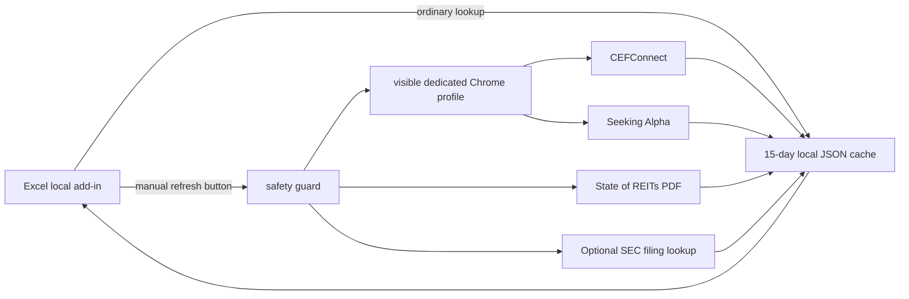

# CAA Data Local Collector

This replaces cloud-origin collection with a local companion running on each authorized PC. It opens a normal visible Chrome/Edge window with a dedicated persistent profile, refreshes only requested stale or missing tickers, waits 6.5 seconds between source requests, and caches each result for 15 days.

It does not use stealth plugins, CAPTCHA bypasses, proxy rotation, or high-concurrency scraping. If a source asks for sign-in or verification, the collector leaves Chrome open for the user to complete it and then stops until the user retries.

Normal site and Excel lookups are cache-only. Source traffic is possible only after a user clicks **Refresh 15-day cache now** in the local add-in. Fresh entries cannot be refreshed early. Runs are serialized, limited to 250 ticker attempts per source in 24 hours, and separated by at least 2 minutes. A 403, 429, or 503 stops the run immediately and creates a persistent 24-hour circuit-breaker cooldown.

## Download

This is a private repository. Sign in to the authorized GitHub account, then use either method.

### Recommended: portable Windows release

The portable ZIP includes its own Node runtime and all JavaScript/PDF/browser-control libraries. The user does not install Node, npm, Python, Playwright, or PDF software.

1. Open the repository's **Releases** page.
2. Download `CAADataLocal-Windows-x64.zip` from the newest release.
3. Extract the entire ZIP to a normal folder such as `C:\CAADataLocal`.
4. Double-click `Setup.bat` once.
5. Double-click `Start.bat` whenever the add-in is used, and leave that window open.

Required external software is limited to Windows, desktop Microsoft Excel, and an installed Chrome or Edge browser. The one-time localhost certificate and Excel manifest installation are still required by Office.

### Clone with Git

```powershell
git clone https://github.com/abigubi/caa-data-local-collector.git
cd caa-data-local-collector
```

### Download a ZIP

1. Open the repository on GitHub.
2. Select **Code > Download ZIP**.
3. Extract the ZIP to a normal local folder such as `C:\CAADataLocal`.
4. Open PowerShell in the extracted folder.

Do not place the shared installation inside another user's OneDrive. Each user should have a separate local folder, cache, and browser profile.

## How it works



The hosted site and ordinary Excel actions can read the cache, but they cannot initiate source collection. Live collection is available only from the local manual-refresh action.

## Data flow

- CEFConnect: daily pricing/expense data, distribution history, annualized NAV returns, fund-page holdings, and common shares outstanding.
- Seeking Alpha: annual consensus FFO and forward annual dividend metrics, using the ordinary source page and its own in-browser response.
- State of REITs: monthly consensus NAV parsed from the published Table 10 PDF.
- SEC: optional recent N-CSR/N-CSRS tax-basis unrealized value. This requires a real contact in `config.json` for the SEC User-Agent.
- Excel: a local task pane writes ordinary numeric values to `CEF Data` or `REIT Data`.

## Install on each Windows PC

For the portable release, skip Node installation and use `Setup.bat`/`Start.bat` as described above.

For a source-code installation:

1. Install [Node.js 22 or newer](https://nodejs.org/).
2. Install or update desktop Microsoft Excel from Microsoft 365.
3. Download or clone this repository as described above.
4. Open PowerShell in the project folder and run:

   ```powershell
   .\setup.ps1
   ```

   This installs the small local dependencies, creates `config.json`, and installs a current-user development certificate for `https://localhost`. The certificate is required because Office task panes must use HTTPS.

   Windows may display a certificate security warning. Approve it only if you intend to trust this project's localhost Office-add-in certificate for the current Windows user.

5. If the optional SEC value is needed, edit `config.json` and set `secUserAgent` to a real CAA contact identity and email.
6. Start the companion and leave its terminal open:

   ```powershell
   .\start.ps1
   ```

7. Confirm [https://localhost:4317/health](https://localhost:4317/health) returns `{"ok":true,...}`.
8. Sideload `manifest-local.xml` in Excel. For a persistent Windows desktop install:

   - Put `manifest-local.xml` in a Windows folder shared with the current user.
   - In Excel, open **File > Options > Trust Center > Trust Center Settings > Trusted Add-in Catalogs**.
   - Add the shared-folder catalog path and select **Show in Menu**.
   - Restart Excel.
   - Open **Home > Add-ins > Shared Folder > CAA Data Local**.

   A Microsoft 365 administrator can deploy the same manifest centrally instead.

The add-in and the original hosted add-in have different IDs, so they can coexist during testing.

## First use

1. Click **Open local collector browser** in the task pane.
2. Complete any CEFConnect or Seeking Alpha login/verification in that visible browser profile. Do not close the profile if a challenge is waiting.
3. Paste or select up to 20 tickers. Click **Use cache & write to Excel** for ordinary work.
4. About every 15 days, click **Refresh 15-day cache now** yourself. Only stale or missing tickers contact the sources.

The suggested operating cycle is:

1. Start the local companion.
2. Refresh the exhibit's requested ticker set once when the cache is due.
3. Review any unavailable or cached-data warnings.
4. Write the values into Excel as often as needed without additional source traffic.
5. Close the PowerShell companion window when finished.

### Monthly multi-workbook workflow

The defaults are sized for roughly 10–15 workbooks containing 5–15 tickers each, up to about 225 ticker rows in a monthly cycle.

1. Start with the first workbook and load its ticker cells.
2. Click **Refresh 15-day cache now**. Only missing or at-least-15-day-old tickers are collected.
3. Write the cached data to the workbook.
4. Move to the next workbook and repeat. Tickers already refreshed for an earlier workbook are skipped without contacting the source.
5. If the two-minute run guard has not elapsed, wait for the displayed `nextAt` time and continue.
6. If more than 250 unique tickers for one source are needed, continue the remainder on the following day instead of raising the limit.

Collection is intentionally slow. A 15-ticker workbook may take several minutes, and a mostly unique 10–15 workbook cycle may take around an hour or more. Keep the computer awake and the companion terminal open. Do not start overlapping refreshes from multiple PCs sharing the same public IP; designate one PC as the live refresher for a cycle.

Cache data and the dedicated browser profile live under `data/` and are excluded from version control. No cookies or credentials are copied into this project; sign-in remains inside Chrome's dedicated profile.

## Optional: keep the ChatGPT Work site UI

The local server allows the existing site origin and exposes compatibility routes at:

- `https://localhost:4317/api/funds`
- `https://localhost:4317/api/holdings`
- `https://localhost:4317/api/cef-tax`
- `https://localhost:4317/api/reits`

In ChatGPT Work, change the site so these requests use the local base URL and remove the browser-side direct CEFConnect attempt. The localhost certificate must be installed and the companion must be running on each PC. The included local manifest avoids that site change entirely and is the recommended rollout path.

## Configuration

Copy defaults are in `config.example.json`:

- `cacheDays`: 15 by default.
- `requestDelayMs`: 6.5-second delay between source requests. Do not reduce it without source approval.
- `manualRefreshOnly`: keep enabled so hosted-site and ordinary Excel lookups never trigger collection.
- `minSourceRunIntervalMinutes`: two minutes between manual runs against the same source.
- `dailyTickerBudgetPerSource`: 250 ticker attempts per rolling 24 hours, enough for the expected monthly workbook cycle.
- `blockedSourceCooldownHours`: circuit-breaker duration after 403, 429, or 503.
- `estimateYears`: the three FFO columns written to Excel.
- `browserExecutable`: optional explicit Chrome or Edge path.
- `browserDebugPort`: dedicated local debugging port used only for this profile.

Local-only files are intentionally excluded from GitHub:

- `config.json`
- `data/cache.json`
- `data/chromium-profile/`
- generated certificate material
- temporary PDFs and test artifacts

## Excel output

The add-in creates or replaces these worksheets:

- `CEF Data`: fund name, holdings, latest distribution, annual distribution count, expense ratio, shares outstanding, and 1/3/5-year NAV returns. Optional SEC columns can be enabled.
- `REIT Data`: 2026/2027/2028 consensus FFO, forward annual dividend, estimate date, consensus NAV, NAV date, and the State of REITs source URL.

Cells are ordinary values, not formulas. Cached rows are highlighted yellow. Unavailable fields are represented as `NA`.

## Safety behavior

- No headless mode, stealth patches, proxy rotation, CAPTCHA bypass, or cookie export.
- One visible persistent browser profile per PC.
- Maximum 20 tickers in an individual request.
- 6.5-second delay and no request concurrency.
- 250 ticker attempts per source during any rolling 24-hour period.
- Two-minute minimum interval between runs against the same source.
- Immediate stop and 24-hour cooldown on 403, 429, or 503.
- Stale data remains readable when a source is unavailable.

No client can guarantee that an external provider will never block an IP. Provider-side IP allowlisting or a source-issued access token is the most reliable option.

## Troubleshooting

### The task pane says the local service is unavailable

- Confirm `start.ps1` is still running.
- Open `https://localhost:4317/health` in the browser.
- Rerun `setup.ps1` if the localhost certificate is missing or expired.

### Chrome asks for sign-in or verification

Complete it manually in the dedicated visible Chrome window, return to Excel, and retry after the displayed safety interval. The collector does not solve or bypass challenges.

### Refresh is blocked by the safety guard

Read the displayed `nextAt` or `blockedUntil` time. Continue using cached values and wait for that time. Restarting the companion does not clear the guard because it is intentionally persisted.

### A ticker returns `Not cached`

Use the local **Refresh 15-day cache now** button. Ordinary cache-only actions never fetch a missing ticker.

### Remove the local add-in

Remove **CAA Data Local** from Excel's add-in catalog/menu, stop the companion, and delete the project folder. The original hosted add-in has a different ID and is unaffected.

## Verification

Run parser tests:

```powershell
npm test
```

Run a one-ticker live smoke test (opens local Chrome):

```powershell
npm run smoke -- --source cef --ticker PDI
npm run smoke -- --source reit --ticker APLE
```

Live smoke tests obey the same cache and safety limits as the add-in.

## Project layout

- `manifest-local.xml`: separate Excel add-in manifest.
- `public/`: task-pane interface and Excel writing logic.
- `src/collectors/`: source-specific collectors.
- `src/cache.js`: persistent cache and IP-safety state.
- `src/orchestrator.js`: cache-only/manual-refresh routing.
- `src/server.js`: local HTTPS service and compatibility endpoints.
- `scripts/`: setup and live smoke checks.
- `test/`: parser and safety-guard tests.
- `Setup.bat` and `Start.bat`: double-click launchers that use the bundled runtime when present.
- `.github/workflows/build-portable.yml`: reproducible private Windows ZIP build.
